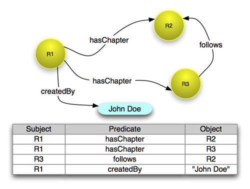
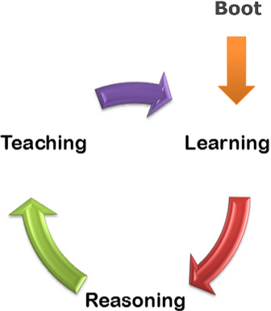

Describing knowledge with KEES (Knowledge Exchange Engine Specifications and Services)
==================================================================

> *In order to let computers to work for us, they must understand data: not just the grammar and the syntax, but the real meaning of things.*

KEES  proposes some specifications to describe a *domain knowledge* in order to **make it tradeable and shareable**. 

A *domain knowledge* is something known about a specific argument (e.g. a set of producs, commercial offerings, a social network, etc. etc). Knowledge domains are additive, there is no limit to the knowledge domain perimeter nor to its size.

KEES allows to *formalize* and *license* all you need to build a knowledge domain, that is:

- how to collect the right data,
- the meaning of the data,
- how much you can trust in your information, 
- what new information you can deduct from the collected data,
- how to answer specific questions using information

Both machines and humans can use this *know how* to increase their knowledge. KEES is a Semantic Web Application.

See [KEES presentation slides](https://docs.google.com/presentation/d/1mv9XO0Q9QFxSphWzT_68Q4aXd9sgqWoY7njomH8eaPQ/pub?start=false&loop=false&delayms=5000)

## Definitions

A lot of concepts used by KEES refer to the well known [Semantic Web Standards](https://www.w3.org/standards/semanticweb/) published by the World Wide Web Consortium ([W3C](https://w3.org/)).

What is **data**? According to common sense, KEES defines data as words, numbers or in general *any string of symbols*.   Example of data is the strings  `xyz`, `123`, `33.22` or  `http://LinkedData.Center`. Data is usually associated with a  _data type_ that states a set of restrictions on symbols sequence that build up the data For example the number `123`, the float `33.22` or the URI `http://LinkedData.Center`. The _data type_ is not the data meaning.

What is **information**? KEES defines informations as *data with a meaning*. The meaning can be learned from the context where a data is found or explicitly defined. KEES adopts the [RDF standards](https://www.w3.org/RDF/) to
describe information by a tuple of three data, i.e. a _triple_ (also known as an RDF statement): a _subject_, a _predicate_, and an _object_. The data type for the first two elements of a triple (i.e. the subject and the predicate) must be a URIs, the last element of the triple (i.e. the object) can be anything. A triple can be also represented as an [unidirected labeled graph](https://mathinsight.org/definition/undirected_graph)

KEES defines **knowledge** as a graph of linked information (i.e. linked data). This graph is possible because, in RDF, any URI can be both the object of a triple and the subject of another one or even the predicate for another.

KEES defines **knowledge base** (or **knowledge graph** ) as a container of *linked data with a purpose*, that is a piece of related information that can be queried to provide answers to some questions. 

From a theoretical point of view, a knowledge base is composed by information (i.e. facts), plus a formal system of logic used for knowledge representation, plus the [Open-world assumption](https://en.wikipedia.org/w/index.php?title=Open-world_assumption&oldid=871019791), plus an inference engine that demonstrates theorems. 

The information is partitioned in two sets: *TBox* and *ABox*. *ABox statements* describe facts,  *TBox statements* describe the terms used to qualify the facts meaning. If you are familiar with the object-oriented paradigm, TBox statements sometimes associate with classes, while ABox associate with individual class instances. 
*TBox statements* tend to be more permanent within a knowledge base and are often grouped in *ontologies* that describe a specific knowledge domain (e.g. business entities, people, goods, friendship, offering, geocoding, etc, etc).
*ABox statements* associated with instances of classes defined by TBox statements. ABox statements are much more dynamic in nature and are populated from datasets available in the web or by reasonings. 

KEES assumes that RDF is used for knowledge representation  and that the knowledge base is implemented 
as a dataset in a [SPARQL service](https://www.w3.org/TR/sparql11-service-description).

The **Language Profile** (or **Application profile**) is the portion of the TBOX that is recognized by a specific software application.

The language profile can contain *axioms *. An **axiom** describes how to generate/validate knowledge base statements using entailment inferred by language profile semantic and known facts. For example, an axiom can be described with OWL and evaluated by an OWL reasoner or described with SPARQL QUERY constructs or with SPARQL UPDATE scripts and evaluated in a SPARQL service.

The **KEES Language Profile** is the set of all terms, rules, and axioms that a software application that wants to use a knowledge base should understand.

A **KEES Agent** describes a processor that understands the *KEES language profile*  and that it is able to do 
actions on a knowledge base according to KEES specifications.
It should be able to learn data, reasoning about data and to answer some questions starting from learned fact.

**Trust** is another key concept in KEES. The [Open-world assumption] and RDF allow mixing any kind of information, even when information that is incoherent. For instance, suppose that an axiom in your knowledge base TBOX states that a property "person:hasMom" has a cardinality of 1 (i.e. every person has just one "mom"), your knowledge base could also contains two different facts (:jack person:hasMom :Mary) and (:jack person:hasMom :Giulia), perhaps extracted from different data sources. In order to take a decision about who is Jack's mom, you need trust in your data. If you are sure about the veracity of all data in the knowledge base, you can deduct that: Mary and  Giulia are two names for the same person. If you are not so sure, you have two possibility: deduct that the data source is wrong, so you have to choose the most trusted statement with respect some criteria (even casually if both statements have the same trust rank) or to change the axiom in TBOX, allowing a person to have more than one mom. In any case, you need to get an idea about _your_ trust on each statement, both in ABox and in Tbox,  in the knowledge base. At least you want to know the **provenance** and all metadata of all information in your knowledge base because the trust on a single data often derives from the trust of its source or in the creator of the data source.

## KEES system components

A KEES system is composed by:
- a **Knowledge Graph** that persists the most updated Knowledge Base. The Knowledge Graph adopts [RDF] and provides an interface to query the Knowledge Base (e.g. a SPARQL service)
_ Some orchestrated **software components**, tat interact with the knowledge graph, ingest new data, reason about existing data and query the knowledge 

Example of such components are:

- **legacy connectors** that extracts RAW data from legaci systems preparining data for ingestion
- **ingestion agents** that translates RAW data into linked data according a language profiles
- **reasoners** that make inferences on ABOX using TBOX or rules
- **api** that perform specific queries to the Knowledge Base in order to answer some question

## KEES data ingestion process

A KEES agent performs data ingestion in a knowledge base through a logical sequence of four temporal phases called *windows*:

1. a startup  phase (**boot window**)  to initialize the knowledge base
2. a time slot for the population of the Knowledge Base and to link data (**learning window**). 
3. a time slot for the data inference (**reasoning window**). 
4. a time slot to access the Knowledge Base and to answering questions (**teaching window**)

Steps 2, 3 and 4 can be iterated till the system converges in a stable configuration.

The sequence of plan execution is called **KEES workflow** and it is a continuous integration process that starts on a triggered event (e.g change in source data, a user request or a scheduled job) on the knowledge base that is in the teaching windows.

## KEES implementations

Here is a [working draft for a KEES implementation proposal](implementation.md)

LinkedData.Center SDaaS product is a commercial early and partial implementation of KEES specifications (also available in a Open Source community version)

## Contributing to this site

A great way to contribute to the site is to create an [issue](https://github.com/linkeddatacenter/kees/issues) on GitHub when you encounter a problem or something. We always appreciate it. You can also edit the code by yourself and create a pull request.

All stuff here in the Creative Common (unless otherwise noted)

[RDF]: https://www.w3.org/TR/rdf11-primer/
[Open-world assumption]: https://en.wikipedia.org/w/index.php?title=Open-world_assumption&oldid=871019791
